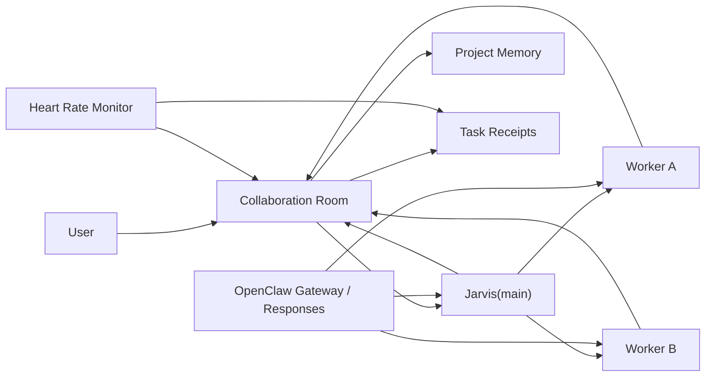

# AI 员工系统交接文档

更新日期：2026-03-24

仓库路径：

- `C:\Users\45441\.openclaw\workspace\external\openclaw-control-center`

运行家目录：

- `C:\Users\45441\.openclaw`

建议配套阅读：

- `README.ai-employee-system.md`

## 1. 这份交接文档的用途

这份文档不是产品介绍，而是给下一个接手开发的 AI 看的真实工程交接。

它主要回答 6 个问题：

- 现在系统到底运行到什么状态
- 最近一批改动是什么
- 哪些约束绝对不能破坏
- 哪些测试和验证已经做过
- 现在哪些地方仍有已知边界/风险
- 下一步最该继续做什么

## 2. 当前总体状态

截至 2026-03-24，当前系统已经从“概念验证”进入“协作稳定性收口 + 受控上下文增强”的阶段。

当前可确认的事实：

- `openclaw-control-center` 代码仓库当前是 clean 的。
- 最近整理后的提交是 `0378272`，提交信息是 `Stabilize collaboration streaming and abort flow`。
- OpenClaw 全局安装已升级到 `2026.3.23`。
- 运行中的 gateway 也已重启到 `2026.3.23`。
- 关键协作链路、共享时间线、上游 abort、fallback 模型自动切换都已验证通过。

当前最重要的产品语义已经固定：

- Jarvis 是主控。
- 右下角协作群聊是当前 room 的共享时间线。
- 员工上下文走受控注入，不允许无边界扫描。
- Jarvis 等用户确认时是受控等待态。

## 3. 最近完成的关键工作

### 3.1 当前项目内最近关键协作摘要自动注入

落点：

- `src/ui/server-collaboration-chat.ts`

核心实现：

- `buildRecentCollaborationSummaryCandidate(...)`
- `buildRecentCollaborationSummaryLines(...)`
- `buildCollaborationAgentPromptV2(...)`

当前规则已经固定：

- 只取当前 `roomId`
- 只取当前项目
- 只取 `sourceEvent.sequence` 之前的事件
- 只保留最近关键项
- 过滤 `<openclaw_coordination>`、`<stage_result>`、reply token、session 信息、路径噪音

这部分已经有测试覆盖，不能再往“全局扫描”方向扩。

### 3.2 Jarvis 等用户确认的等待态稳定性

核心落点：

- `src/ui/server-collaboration-chat.ts`
- `src/runtime/heart-rate-monitor.ts`
- `src/runtime/collaboration-room.ts`

关键语义：

- `waitingFor = "user_confirmation"`
- `reviewState = "awaiting_review"`
- `lastResultState = "awaiting_review"`
- task 保持 `in_progress`

当前保护逻辑：

- 心跳机制不再把这类 receipt 当成 recovery candidate
- 即使 receipt 还是旧 `in_progress` 数据，只要最近主控回复明确在等用户确认，且之后没有新用户消息，也不要判 stale

### 3.3 协作群聊共享时间线修复

核心落点：

- `src/ui/server-collaboration-room.ts`

当前语义：

- transcript-first
- 不同员工的 reply 不互相覆盖
- transcript reply 可以先进入共享时间线
- local canonical event 补上后再做精确去重
- 身份识别优先使用 `author` / `sourceSessionKey`

这条链路的目标已经非常明确：

- 协作群聊不是 main 单聊视图
- 它是 room 级共享时间线

### 3.4 终止按钮与上游 `chat.abort`

核心落点：

- `src/ui/collaboration-chat-widget-script-prelude.ts`
- `src/ui/server.ts`
- `src/ui/server-collaboration-chat.ts`
- `src/clients/openclaw-gateway-stream.ts`

已经完成的修复：

- 群聊 terminate 按钮触发真正的上游 `chat.abort`
- 协作 turn 维护 `sessionKey/runId`
- pre-start abort miss 可以接受有限重试
- upstream abort 失败时不再假装本地已经停干净，而是明确提示可能继续回复

### 3.5 OpenClaw 流式链路优先级与 fallback 模型

核心落点：

- `src/clients/openclaw-live-client.ts`
- `src/clients/openclaw-gateway-stream.ts`
- `src/runtime/openclaw-agent-models.ts`

已经完成的行为：

- 协作 turn 请求 gateway stream 时，优先走 gateway
- gateway 启动失败再回退到 `/v1/responses`
- 上游不可用时自动切到 fallback 模型重试
- 员工卡片模型配置支持主模型和 fallback 模型

### 3.6 OpenClaw 升级到 `v2026.3.23`

已经完成：

- 全局 OpenClaw 包升级到 `2026.3.23`
- `gateway.cmd` 版本标记同步到 `2026.3.23`
- 运行中的 gateway 已重启

升级前后的结论：

- 没有发现会直接破坏我们当前协作群聊/共享时间线/abort 流的 breaking change
- 对我们更相关的是 gateway/probe 修复，整体偏利好

## 4. 当前真实架构



### 4.1 主要模块

- `src/ui/server.ts`
  - HTTP 入口、页面、SSE
- `src/ui/server-collaboration-chat.ts`
  - 派工、prompt、stage result、fanout、terminate
- `src/ui/server-collaboration-room.ts`
  - room 视图、transcript 合并、共享时间线
- `src/runtime/collaboration-room.ts`
  - room canonical store
- `src/runtime/collaboration-project-memory.ts`
  - 项目记忆 scaffold 与写入
- `src/runtime/heart-rate-monitor.ts`
  - 恢复机制
- `src/clients/openclaw-live-client.ts`
  - gateway stream / `/v1/responses` / CLI fallback 编排
- `src/clients/openclaw-gateway-stream.ts`
  - `connect.challenge`、`chat.send`、`chat.abort`

### 4.2 当前共享群聊前端链路

前端文件：

- `src/ui/collaboration-chat-widget-script-prelude.ts`
- `src/ui/collaboration-chat-widget-script-actions.ts`

后端链路：

- `GET /api/collaboration/room`
- `GET /api/collaboration/room/stream`
- `POST /api/collaboration/room/messages`
- `POST /api/collaboration/room/terminate`

当前是“共享 room 快照流”，不是 main 私聊镜像。

## 5. 绝对不能破坏的约束

### 5.1 不要弱化右下角协作群聊

不要做这些事：

- 隐藏入口
- 改成次级功能
- 退回主聊天镜像
- 只显示 Jarvis，不显示 worker

### 5.2 不要放开员工自由扫描

不要做这些事：

- 员工自动扫全房间历史
- 员工自动扫整个仓库
- 员工自己从任意旧 room 抽上下文

继续坚持的方向是：

- 受控 prompt 注入
- 当前项目边界
- 当前 room 边界

### 5.3 不要误处理 Jarvis 等确认状态

不要把它：

- 当成 completed
- 当成 approved
- 当成 stalled
- 当成 heart-rate recovery target

### 5.4 不要把 `C:\Users\45441\.openclaw` 当源码仓库硬清

它是家目录/运行目录，不是干净源码根。
真正要保持 clean 的仓库是：

- `workspace/external/openclaw-control-center`

## 6. 已验证结果

### 6.1 代码仓库状态

`openclaw-control-center` 当前状态：

- clean
- 最近提交：`0378272`

### 6.2 关键测试

最近已跑并通过：

```powershell
node --import tsx --test test/openclaw-gateway-stream.test.ts test/openclaw-live-client-agent-turn.test.ts test/server-collaboration-chat.test.ts test/collaboration-room.test.ts
npm run build
```

结果：

- `83/83` 通过
- `npm run build` 通过

### 6.3 运行态烟雾验证

已经实际验证：

- `openclaw --version` 为 `2026.3.23`
- gateway 正在监听 `18789`
- `4310`/`4311` 页面可访问
- `/api/collaboration/room/stream` 能返回 `ready/snapshot`
- 已有 fanout room 仍能同时看到 Jarvis 和 worker reply

## 7. 已知边界与坑

### 7.1 `healthz` 的 `503` 不一定代表应用挂了

在 `src/ui/server.ts` 中：

- `/healthz` 在 snapshot stale 时会回 `503`

这会让 `npm run smoke:ui` 偶尔误报失败。
如果首页和协作接口仍然可访问，不要第一时间判断为升级把 UI 打挂。

### 7.2 当前群聊仍不是最理想的原生 token 流

当前效果已经是共享时间线上的增量草稿，但仍是：

- live draft + room snapshot SSE

还不是：

- 直接 token callback 到 UI

如果以后继续推进真流式，应优先要求上游提供稳定 session/event stream。

### 7.3 PowerShell 读旧中文文档可能出现乱码

旧 README/旧交接文档在某些 PowerShell 输出里会有编码显示异常。
不要因此误判仓库内容损坏。

### 7.4 `~/.openclaw` 根目录 Git 状态大量未跟踪是正常的

那是运行态文件，不要清。

## 8. 当前最推荐的下一步

### 第一优先级

继续把协作稳定性做实，不要先做大 UI 改版：

- 共享时间线正确性
- worker 可见性
- terminate 真中止
- waiting/heartbeat 一致性

### 第二优先级

继续提升受控上下文质量：

- recent collaboration summary 的选择质量
- project summary / open tasks / decisions / stage log 注入质量

### 第三优先级

如果上游支持，再推进真正 token 级流式：

- session/event stream
- token callback
- 前端更细粒度渲染

### 最后再做

- 大型 UI 结构改版
- 重新设计群聊外壳
- 改动右下角群聊交互地位

## 9. 推荐接手阅读顺序

如果你是下一个 AI，建议按这个顺序读：

1. `README.ai-employee-system.md`
2. `src/ui/server-collaboration-chat.ts`
3. `src/ui/server-collaboration-room.ts`
4. `src/runtime/collaboration-room.ts`
5. `src/runtime/collaboration-project-memory.ts`
6. `src/runtime/heart-rate-monitor.ts`
7. `src/clients/openclaw-live-client.ts`
8. `src/clients/openclaw-gateway-stream.ts`

## 10. 一句话总结

当前项目最正确的方向不是“再堆更多功能”，而是：

在不弱化右下角协作群聊、不放开员工自由扫描的前提下，把共享时间线、受控上下文注入、Jarvis 等确认等待态、上游流式与中止链路继续做稳。

